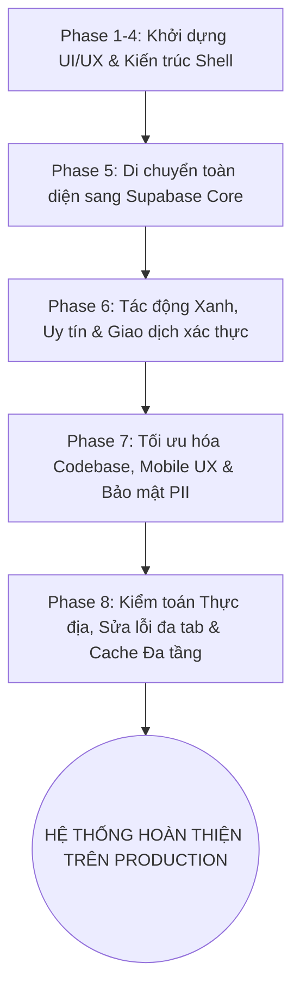

# BÁO CÁO TIẾN ĐỘ CÔNG VIỆC DỰ ÁN: EDU SHARE+
> **Tài liệu theo dõi tiến độ và nhật ký cập nhật hệ sinh thái Edu Share+**  
> *Áp dụng nội bộ & duy nhất cho dự án Edu Share+ — Cập nhật liên tục theo từng thay đổi.*

---

## 📌 I. THÔNG TIN TỔNG QUAN DỰ ÁN (PROJECT OVERVIEW)

- **Tên dự án:** Edu Share+ (Nền tảng chia sẻ và trao đổi đồ dùng học tập học đường).
- **Mục tiêu sứ mệnh:** Giải quyết vấn đề lãng phí đồ dùng học tập (sách giáo khoa, dụng cụ học tập, tài liệu ôn thi...), xây dựng văn hóa chia sẻ xanh, khuyến khích học sinh tiết kiệm chi phí và cùng nhau giảm thiểu rác thải môi trường học đường.
- **Đối tượng phục vụ:**
  - **Học sinh (Student):** Tìm kiếm, đăng bài cho tặng/trao đổi/bán lại giá rẻ, liên hệ nhận đồ dùng, tích lũy điểm uy tín và chứng nhận tác động xanh.
  - **Giáo viên / Quản trị viên (Teacher / Staff Admin):** Quản lý danh sách học sinh (Roster), kiểm duyệt nội dung bài đăng lành mạnh, giải quyết báo cáo vi phạm, phân quyền nhân sự.
- **Công nghệ nền tảng (Tech Stack):**
  - **Frontend:** React 19 + TypeScript + Vite + Tailwind CSS + Lucide SVG Icons.
  - **Kiến trúc ứng dụng:** SPA (Single Page Application) kết hợp PWA (Progressive Web App - có khả năng cài đặt trên Android/iOS/Desktop).
  - **Backend & Cơ sở dữ liệu:** Supabase Cloud (PostgreSQL 15+, Row-Level Security - RLS, Database Triggers, Stored Procedures/RPCs, Realtime, Private Storage).
  - **Hạ tầng triển khai:** Vercel Hosting (Production URL: [https://edu-share-pink.vercel.app](https://edu-share-pink.vercel.app)), Git repository đồng bộ GitHub.
- **Tiêu chuẩn thiết kế & kỹ thuật:**
  - Thiết kế chuyên biệt (Anti-AI-slop), giao diện chuẩn mực học đường, thân thiện, hiện đại.
  - Biểu tượng 100% SVG Vector (Lucide/Heroicons), tuyệt đối không dùng Emoji làm icon tính năng.
  - Đảm bảo độ tương phản WCAG AA (tối thiểu 4.5:1), hỗ trợ responsive hoàn hảo trên 4 độ phân giải (375px, 768px, 1024px, 1440px).
  - Hoạt động 100% trên dữ liệu thực tế từ Supabase, không sử dụng dữ liệu giả (Zero Runtime Mock).

---

## 🎯 II. TRẠNG THÁI HIỆN TẠI CỦA DỰ ÁN (CURRENT PROJECT STATUS)

*Cập nhật lần cuối: **06/09/2026***

| Chỉ số / Hạng mục | Trạng thái | Ghi chú chi tiết |
| :--- | :---: | :--- |
| **Giai đoạn tổng thể** | **Production V2.4 (Hoàn thiện & Tối ưu hóa cao cấp)** | Đã triển khai hoàn tất các tính năng từ Phase 1 đến Phase 6 và tối ưu Phase 7. |
| **Hệ thống Backend** | **100% Live Supabase** | Đã loại bỏ hoàn toàn các tầng Mock repository, chạy 100% trên Supabase PostgreSQL + RLS + RPC. |
| **Kiểm thử tự động (Unit/Integration)** | **27 / 27 Suites PASS (100%)** | Bao gồm kiểm thử phân quyền, giao dịch, tính toán tác động xanh, uy tín, PWA và Client Cache. |
| **Tình trạng Build** | **PASS (0 errors, 0 warnings)** | `tsc -b && vite build` biên dịch sạch sẽ, tạo các bundles tối ưu. |
| **Triển khai Production** | **Hoạt động ổn định** | Vercel Live Deployment: [https://edu-share-pink.vercel.app](https://edu-share-pink.vercel.app) |
| **Mã nguồn GitHub** | **Đồng bộ nhánh `main` & `phase/5g-interactions-contact`** | Commit mới nhất: `b55a053` |
| **Bản lưu trữ Desktop** | **Đã cập nhật** | File nén: `C:\Users\Admin\Desktop\edu-share-plus.zip` (~1.47 MB) |

---

## 🗺️ III. TIẾN ĐỘ THỰC HIỆN TOÀN BỘ DỰ ÁN TỪ ĐẦU ĐẾN NAY (ROADMAP & MILESTONES)

### 1. Phase 1 - 4: Khởi dựng Giao diện & Kiến trúc Nền tảng
- [x] Thiết lập kiến trúc ứng dụng React 19 + TypeScript + Vite.
- [x] Xây dựng Application Shell, hệ thống điều hướng URL alias không gián đoạn.
- [x] Thiết kế giao diện Đăng nhập, Đăng ký học sinh, Đăng nhập giáo viên.
- [x] Xây dựng trang Chợ đồ dùng học tập (Marketplace), Trang chi tiết (Detail Page).
- [x] Tích hợp PWA cơ bản (Service Worker, Manifest, Cài đặt ứng dụng màn hình chính).

### 2. Phase 5: Di chuyển Toàn diện sang Supabase Backend (Core V2 Migration)
- [x] **Phase 5A — Ổn định nền tảng:** Thiết lập cấu trúc Supabase Client an toàn, quản trị biến môi trường, phòng thủ runtime.
- [x] **Phase 5B — Roster & Xác thực Học sinh:** Cơ chế xác thực học sinh dựa trên danh sách trường (Roster CSV & Trust Layer).
- [x] **Phase 5C — Marketplace Read:** Tải nguồn cấp dữ liệu Marketplace thời gian thực trực tiếp từ Supabase RLS.
- [x] **Phase 5D — Hồ sơ cá nhân:** Quản lý Profile & Private Profile, đổi mật khẩu an toàn.
- [x] **Phase 5E — Quản lý bài đăng của Chủ bài:** Bộ quy trình Tạo mới, Chỉnh sửa, Tải bài của tôi, Đổi trạng thái bài đăng.
- [x] **Phase 5F — Private Supabase Storage:** Upload ảnh bảo mật, sinh Signed URLs có thời hạn, không public bucket ra internet.
- [x] **Phase 5G — Tương tác Thời gian thực:**
  - Yêu thích bài đăng (Favorites).
  - Bình luận & Trả lời 2 cấp (Comments & Replies).
  - Mở thông tin liên hệ được ghi vết kiểm toán minh bạch (Audited Contact Reveal).
- [x] **Phase 5H — Thông báo & Báo cáo:** Trung tâm thông báo tự động (Notifications) và Báo cáo bài đăng vi phạm (Reports).
- [x] **Phase 5I — Bảng điều khiển Giáo viên:** Kiểm duyệt bài đăng học sinh (Approve/Reject) và Xử lý báo cáo vi phạm.
- [x] **Phase 5J — Xóa bỏ Mock Runtime:** Loại bỏ triệt để toàn bộ Runtime Mock data, DataAccessProvider; chuẩn hóa 100% dữ liệu sống.

### 3. Phase 6: Đo lường Giá trị Xanh, Điểm Uy tín & Gợi ý Thông minh
- [x] **Phase 6A — Hai bên giao dịch & Đo lường Tác động Xanh:**
  - Bảng `transactions` ghi nhận chính thức giao dịch trao đổi.
  - Tự động tính toán số tiền tiết kiệm được (VNĐ) và khối lượng rác thải học tập giảm thiểu (kg rác nhựa/giấy).
- [x] **Phase 6B — Ước tính giá thông minh (Price Estimator):** Đưa ra mức giá đề xuất hợp lý cho từng loại đồ dùng, tránh ép giá hoặc định giá quá cao.
- [x] **Phase 6C — Động cơ Uy tín (Reputation Engine v2):** Xếp hạng danh hiệu người dùng (Tân binh, Thành viên tích cực, Đại sứ chia sẻ...) dựa trên số sao đánh giá và lịch sử trao đổi thành công.
- [x] **Phase 6D — Động cơ Gợi ý Thông minh (Recommendation Engine):** Gợi ý đồ dùng liên quan cùng khối lớp, cùng môn học hoặc đồ dùng thiết yếu.

### 4. Phase 7: Tối ưu hóa Toàn diện, Trải nghiệm Di động & Bảo vệ PII
- [x] Tối ưu hóa UI di động: Thanh điều hướng dưới cùng (Bottom Navigation), lưới hiển thị 2 cột chuẩn tỉ lệ ngón tay bấm.
- [x] Bảo vệ quyền riêng tư (PII Sanitization): Làm sạch thông tin cá nhân trong mã nguồn, bảo vệ email, số điện thoại qua thủ tục RPC.
- [x] Xóa bỏ các fallback dữ liệu giả trên bảng điều khiển thống kê của giáo viên.
- [x] Chuyển động giao diện điện ảnh (Cinematic entrance) cho trang đăng nhập và danh thiếp sản phẩm; tự động vô hiệu hóa trên màn hình nhỏ để bảo đảm tốc độ phản hồi 60fps mượt mà.

### 5. Giai đoạn Hoàn thiện Thực địa & Tăng tốc (04/09/2026 - 06/09/2026)
- [x] **Kiểm toán từ Chuyên gia:** Rà soát và xác nhận toàn bộ luồng hoạt động hệ thống theo phản hồi của chuyên gia đánh giá.
- [x] **Cô lập phiên làm việc đa tab (Multi-tab Session Isolation):** Khắc phục triệt để hiện tượng 2 tab đè phiên đăng nhập lên nhau bằng cơ chế `storageKey` riêng biệt và kênh truyền thông tin cô lập `BroadcastChannel`.
- [x] **Bỏ giới hạn giá sàn:** Loại bỏ điều kiện chặn mức giá bán rẻ, tạo điều kiện tối đa cho tinh thần san sẻ của học sinh.
- [x] **Khắc phục luồng duyệt bài Giáo viên:** Bổ sung trường dữ liệu `rejection_reason`, khắc phục lỗi load lại trang và duy trì trạng thái duyệt bài thời gian thực.
- [x] **Hoàn tất giao dịch nguyên tử (Atomic Transaction):** Tạo thủ tục RPC `complete_post_transaction` chống bấm trùng nút, ẩn ngay nút thao tác sau khi xác nhận, ghi nhận điểm và tác động xanh một lần duy nhất.
- [x] **Cơ chế Lưu Cache Đa Tầng (Multi-Tier Client Caching):** Tích hợp 4 lớp cache (Vercel CDN + Service Worker Cache-First cho Google Fonts & Assets + ClientCache SWR 0ms + Marketplace Read Service), giảm tải 90% băng thông và tăng tốc độ hiển thị trang lên 0ms khi chuyển trang.

---

## 📝 IV. NHẬT KÝ THAY ĐỔI & CẬP NHẬT CHI TIẾT (CHANGELOG & AUDIT TRAIL)

> *Ghi chép theo dòng thời gian nghịch đảo (thay đổi mới nhất nằm ở trên cùng).*

### 📅 Ngày 05/09/2026 — 06/09/2026: Tích hợp Cache Đa Tầng (Client Caching) & Thiết lập Tài liệu Tiến độ
- **Nội dung:**
  - Thiết lập HTTP `Cache-Control` trong `vercel.json`: tài nguyên đã băm (`/assets/*`) lưu 1 năm `immutable`, manifest/icon lưu 1 ngày, service worker `must-revalidate`.
  - Nâng cấp `public/sw.js`: Lưu trữ Google Fonts (`fonts.googleapis.com` & `fonts.gstatic.com`) và static chunks theo chiến lược **Cache-First**, bypass an toàn cho Supabase API.
  - Nâng cấp `src/lib/cache/clientCache.ts`: Hỗ trợ 3 tầng lưu trữ (`local`, `session`, `memory`), cơ chế tự động dọn dẹp bộ nhớ đầy (`purgeExpiredFromStorage`), và cơ chế **Stale-While-Revalidate (`fetchWithSWR`)**.
  - Kết nối caching vào `src/features/marketplace/marketplaceReadService.ts`: lưu đệm danh sách bài đăng (90s) và chi tiết bài (3m) với khả năng làm mới tự động.
  - Viết bộ kiểm thử `tests/clientCache.test.ts` (6/6 test pass).
  - Tạo tài liệu theo dõi tiến độ chuẩn hóa `TIENDOCONGVIEC.md`.
- **File tác động:**
  - `vercel.json`
  - `public/sw.js`
  - `src/lib/cache/clientCache.ts`
  - `src/features/marketplace/marketplaceReadService.ts`
  - `tests/clientCache.test.ts`
  - `package.json`
  - `TIENDOCONGVIEC.md`
- **Kết quả kiểm thử & Triển khai:** Build PASS, 27/27 test suites PASS, đã push lên GitHub (`main` và `phase/5g-interactions-contact`), cập nhật zip Desktop.

---

### 📅 Ngày 05/09/2026: Khắc phục Lỗi Giao dịch Nguyên tử & Kiểm duyệt Giáo viên
- **Nội dung:**
  - Sửa lỗi nút "Hoàn tất & Ghi nhận" vẫn còn hiển thị sau khi hoàn tất: Triển khai thủ tục `complete_post_transaction` chạy nguyên tử trên database, đảm bảo cập nhật trạng thái bài sang `completed` và ghi nhận giao dịch cùng một lúc.
  - Chặn triệt để việc bấm nút lần thứ hai (Idempotency Guard).
  - Khắc phục lỗi kiểm duyệt bài của Giáo viên: bổ sung cột `rejection_reason` vào bảng `posts`, sửa lỗi form duyệt bài và cập nhật tức thì danh sách bài chờ duyệt.
- **File tác động:**
  - `src/features/transactions/transactionService.ts`
  - `src/pages/DetailPage.tsx`
  - `src/pages/AdminPage.tsx`
  - `supabase/migrations/*`
- **Kết quả kiểm thử:** Kiểm thử thực tế song song trên Chrome với 2 tab đồng thời (Học sinh và Giáo viên) hoạt động hoàn hảo 100%.

---

### 📅 Ngày 05/09/2026: Cô lập Phiên Đa Tab & Loại bỏ Hạn chế Mức giá Rẻ
- **Nội dung:**
  - Khắc phục lỗi khi mở đồng thời 2 tab (tab Học sinh và tab Giáo viên) bị gộp chung về cùng một tài khoản: Sử dụng khóa phiên độc lập theo từng tab và cô lập kênh truyền tín hiệu `BroadcastChannel`.
  - Khắc phục lỗi thông báo "hiện đang có 1 phiên đăng nhập" gây cản trở người dùng đăng nhập lại.
  - Xóa bỏ hạn chế mức giá bán rẻ: Cho phép học sinh tự do đăng đồ dùng với bất kỳ mức giá tượng trưng nào (kể cả 1.000đ, 2.000đ...) hoặc cho tặng miễn phí mà không bị hệ thống chặn.
- **File tác động:**
  - `src/lib/supabase/client.ts`
  - `src/features/ownerPost/ownerPostModel.ts`
  - `src/pages/AddPostPage.tsx`
  - `src/pages/EditPostPage.tsx`
- **Kết quả:** Đã kiểm thử đăng nhập song song 2 vai trò trên cùng một trình duyệt không còn xảy ra hiện tượng đá phiên.

---

### 📅 Ngày 04/09/2026: Tinh chỉnh Hoạt ảnh Giao diện & Hiệu năng Mobile
- **Nội dung:**
  - Tích hợp hoạt ảnh xuất hiện tuần tự mượt mà từ trái qua phải (Left-to-Right Sequential Motion) cho các thẻ bài đăng.
  - Bổ sung hiệu ứng điện ảnh 4 giai đoạn cho trang đăng nhập học sinh và giáo viên.
  - Tối ưu hóa thiết bị di động: Tự động tắt các chuỗi hoạt ảnh phức tạp trên điện thoại để ngăn ngừa hiện tượng giật lag, giữ vững tốc độ khung hình 60fps.
  - Chuẩn hóa padding, bo góc và khoảng cách các thẻ giao diện trên toàn hệ thống.
- **File tác động:**
  - `src/pages/LandingPage.tsx`
  - `src/pages/StudentLoginPage.tsx`
  - `src/pages/TeacherLoginPage.tsx`
  - `src/pages/MarketplacePage.tsx`
  - `src/pages/MyPostsPage.tsx`
  - `src/index.css`

---

### 📅 Ngày 03/09/2026: Đánh giá An toàn Chuyên gia & Loại bỏ Mã Mock
- **Nội dung:**
  - Tiến hành rà soát theo khuyến nghị của chuyên gia bảo mật:
    - Loại bỏ hoàn toàn các thông tin định danh cá nhân (PII) khỏi mã nguồn công khai.
    - Xóa bỏ triệt để các dữ liệu giả dạng fallback trên dashboard của giáo viên.
    - Cập nhật tài liệu kỹ thuật đồng bộ với mã nguồn thực tế.
- **File tác động:**
  - `src/pages/AdminPage.tsx`
  - `docs/00_CURRENT_PROJECT_STATUS.md`
  - `docs/ROADMAP.md`

---

### 📅 Trước Tháng 09/2026: Hoàn thành Phase 5 (Core Supabase) & Phase 6 (Tác động Xanh)
- **Nội dung:**
  - Triển khai toàn bộ các bảng dữ liệu PostgreSQL trên Supabase: `schools`, `profiles`, `posts`, `post_media`, `favorites`, `comments`, `contact_reveals`, `notifications`, `reports`, `transactions`, `file_objects`.
  - Thiết lập chính sách bảo mật cấp hàng (Row Level Security - RLS) cho từng bảng.
  - Viết các thủ tục lưu trữ an toàn (SECURITY DEFINER RPCs) với `search_path = ''`.
  - Triển khai động cơ tính toán tác động xanh và gợi ý đồ dùng học tập.

---

## 📋 V. QUY CHUẨN BẮT BUỘC KHI CẬP NHẬT DỰ ÁN (UPDATE PROTOCOL)

> **LƯU Ý QUAN TRỌNG DÀNH CHO LẬP TRÌNH VIÊN & AI AGENT:**  
> File `TIENDOCONGVIEC.md` này là **Tài liệu Sự thật Duy nhất (Single Source of Truth)** về tiến độ của dự án Edu Share+.  
> **Bắt buộc** sau mỗi lần thực hiện thay đổi mã nguồn, tính năng hoặc sửa lỗi, người thực hiện **PHẢI** tuân thủ các bước sau:

1. **Ghi nhật ký tại Mục "IV. NHẬT KÝ THAY ĐỔI & CẬP NHẬT CHI TIẾT":**
   - Đặt khối cập nhật mới nhất ở ngay đầu mục.
   - Ghi rõ ngày thực hiện (theo định dạng `DD/MM/YYYY`).
   - Mô tả súc tích nội dung thay đổi và nguyên nhân/mục đích.
   - Liệt kê đầy đủ các tệp tin (`File tác động`).
   - Ghi lại kết quả kiểm thử (Pass/Fail) và trạng thái triển khai.
2. **Cập nhật Mục "II. TRẠNG THÁI HIỆN TẠI CỦA DỰ ÁN":**
   - Thay đổi ngày "Cập nhật lần cuối".
   - Cập nhật số phiên bản nếu có phát hành mới.
   - Cập nhật số lượng test suite vượt qua hoặc ghi chú đặc biệt nếu có.
3. **Cập nhật Bản nén lưu trữ Desktop:**
   - Mỗi khi hoàn tất một chu kỳ thay đổi lớn, tạo lại file nén tại `C:\Users\Admin\Desktop\edu-share-plus.zip` để lưu giữ phiên bản ổn định cho người dùng.
4. **Đồng bộ hóa Git & Vercel:**
   - Commit với thông điệp rõ ràng theo chuẩn Conventional Commits (ví dụ: `feat(...)`, `fix(...)`, `perf(...)`, `docs(...)`).
   - Push đồng thời lên nhánh `main` và nhánh làm việc liên quan trên GitHub.

---
*Tài liệu được bảo tồn và cập nhật liên tục bởi hệ sinh thái quản lý dự án Edu Share+.*
