# 06 — Database ERD

## Status

**Checkpoint 3B target ERD — design approved candidate, not yet implemented.**

This document defines the target relational model for EDU SHARE+. It does not create tables, migrations, RLS policies, Supabase projects, Auth users, Storage buckets, or production data.

The Phase 1 UI/UX/legacy routes remain frozen. Database normalization is allowed only below the repository/service boundary and must preserve the existing user-facing behavior.

---

## 1. Modeling principles

1. **Auth identity is UUID-based.** Email is an attribute, never the relational identity key.
2. **Legacy accounts are not migrated.** New users register again in the new Auth system.
3. **Post moderation, lifecycle, visibility and comment availability are separate concepts.**
4. **Post completion is not transaction proof.** A real exchange outcome is represented by `transactions`.
5. **Moderation is not product verification.** Verification has its own request/result history.
6. **Price estimates are explainable, versioned and immutable snapshots.** They never overwrite the seller's chosen price.
7. **Sensitive evidence and private student information are isolated from public marketplace payloads.**
8. **Privileged/material actions are auditable.** Domain history and security audit are related but not interchangeable.
9. **Operational analytics and research evidence remain separate.** Historical KHKT survey files are not imported into the live operational schema by default.
10. **Target ERD does not imply one-shot implementation.** Tables are introduced by later phases only when their feature becomes active.

---

## 2. Schema boundaries

### `public` schema

Application-facing operational entities protected by RLS when implemented:

- identity/profile data required by the app;
- marketplace content and interactions;
- moderation workflow;
- verification workflow;
- transaction workflow;
- case/support workflow;
- price estimator records;
- reputation records;
- application file metadata.

### `private` schema

Not intended for direct browser access:

- `audit_logs`;
- `analytics_events`;
- `legacy_import_map`;
- future trusted helper functions/materialized operational aggregates where appropriate.

Historical survey datasets remain outside the operational database by default. If a research schema is introduced later, it must be governed separately and must not be implied by the Admin role.

---

## 3. Core ERD — end-to-end system

```mermaid
erDiagram
    AUTH_USERS ||--|| PROFILES : "identity"
    SCHOOLS ||--o{ SCHOOL_CLASSES : contains
    SCHOOLS ||--o{ PROFILES : affiliates
    SCHOOL_CLASSES ||--o{ PROFILES : current_class
    PROFILES ||--|| PROFILE_PRIVATE : has

    ROLES ||--o{ USER_ROLES : grants
    PROFILES ||--o{ USER_ROLES : receives
    SCHOOLS ||--o{ USER_ROLES : scopes
    PROFILES ||--o{ ACCOUNT_REVIEWS : reviewed_account
    PROFILES ||--o{ ACCOUNT_REVIEWS : reviewer

    CATEGORIES ||--o{ POSTS : categorizes
    PROFILES ||--o{ POSTS : owns
    SCHOOLS ||--o{ POSTS : school_scope
    SCHOOL_CLASSES ||--o{ POSTS : class_snapshot

    POSTS ||--o{ POST_MEDIA : has
    FILE_OBJECTS ||--o{ POST_MEDIA : stores
    POSTS ||--o{ POST_STATUS_HISTORY : changes
    PROFILES ||--o{ POST_STATUS_HISTORY : actor

    PROFILES ||--o{ FAVORITES : saves
    POSTS ||--o{ FAVORITES : saved_post
    PROFILES ||--o{ COMMENTS : writes
    POSTS ||--o{ COMMENTS : contains
    COMMENTS ||--o{ COMMENTS : replies
    PROFILES ||--o{ CONTACT_EVENTS : requester
    POSTS ||--o{ CONTACT_EVENTS : contact_for
    PROFILES ||--o{ NOTIFICATIONS : receives

    POSTS ||--o{ MODERATION_ACTIONS : moderated
    POST_STATUS_HISTORY ||--o| MODERATION_ACTIONS : specialized_action
    PROFILES ||--o{ MODERATION_ACTIONS : moderator

    PROFILES ||--o{ REPORTS : reporter
    POSTS ||--o{ REPORTS : post_target
    COMMENTS ||--o{ REPORTS : comment_target
    PROFILES ||--o{ REPORTS : user_target

    POSTS ||--o{ VERIFICATION_REQUESTS : verification_for
    PROFILES ||--o{ VERIFICATION_REQUESTS : requester
    PROFILES ||--o{ VERIFICATION_REQUESTS : assigned_verifier
    VERIFICATION_REQUESTS ||--o{ VERIFICATION_RESULTS : results
    PROFILES ||--o{ VERIFICATION_RESULTS : verifier
    VERIFICATION_REQUESTS ||--o{ VERIFICATION_EVIDENCE : evidence
    VERIFICATION_RESULTS ||--o{ VERIFICATION_EVIDENCE : result_evidence
    FILE_OBJECTS ||--o{ VERIFICATION_EVIDENCE : stores

    POSTS ||--o{ TRANSACTIONS : outcome_for
    PROFILES ||--o{ TRANSACTIONS : owner
    PROFILES ||--o{ TRANSACTIONS : counterparty
    CONTACT_EVENTS ||--o| TRANSACTIONS : may_origin
    TRANSACTIONS ||--o{ TRANSACTION_EVENTS : history
    PROFILES ||--o{ TRANSACTION_EVENTS : actor

    REPORTS ||--o| CASES : may_escalate
    POSTS ||--o{ CASES : concerns
    TRANSACTIONS ||--o{ CASES : concerns
    VERIFICATION_REQUESTS ||--o{ CASES : concerns
    PROFILES ||--o{ CASES : opens
    PROFILES ||--o{ CASES : assigned_handler
    CASES ||--o{ CASE_PARTICIPANTS : participants
    PROFILES ||--o{ CASE_PARTICIPANTS : participates
    CASES ||--o{ CASE_UPDATES : history
    PROFILES ||--o{ CASE_UPDATES : actor
    CASES ||--o{ CASE_EVIDENCE : evidence
    FILE_OBJECTS ||--o{ CASE_EVIDENCE : stores

    PRICE_MODEL_VERSIONS ||--o{ PRICE_ESTIMATES : computes
    PROFILES ||--o{ PRICE_ESTIMATES : requests
    POSTS ||--o{ PRICE_ESTIMATES : estimates_for
    CATEGORIES ||--o{ PRICE_REFERENCE_DATA : classifies
    PRICE_ESTIMATES ||--o{ PRICE_ESTIMATE_REFERENCES : cites
    PRICE_REFERENCE_DATA ||--o{ PRICE_ESTIMATE_REFERENCES : referenced

    REPUTATION_MODEL_VERSIONS ||--o{ REPUTATION_EVENTS : scores_by
    PROFILES ||--o{ REPUTATION_EVENTS : receives

    FILE_OBJECTS ||--o| PROFILES : avatar
    FILE_OBJECTS ||--o| PROFILE_PRIVATE : private_face_image
```



`AUTH_USERS` represents the Auth provider's managed user table. It is not created by our application schema.

---

## 4. Identity, organization and access

### `schools`

Purpose: support current school deployment while remaining scale-ready.

Key fields:

- `id uuid PK`
- `code text UNIQUE`
- `name text`
- `is_active boolean`
- `created_at timestamptz`

### `school_classes`

Purpose: stable class reference by academic year so historical posts do not silently move when a student changes class.

Key fields:

- `id uuid PK`
- `school_id uuid FK -> schools`
- `label text` — legacy-compatible label such as `12A1`
- `grade_level smallint`
- `academic_year text`
- `is_active boolean`

Recommended uniqueness: `(school_id, label, academic_year)`.

### `profiles`

Purpose: non-secret operational profile and current account state.

Key fields:

- `user_id uuid PK/FK -> auth.users.id`
- `school_id uuid FK`
- `class_id uuid FK NULL`
- `full_name text`
- `account_status` — `pending_review | approved | rejected | suspended`
- `avatar_file_id uuid FK -> file_objects NULL`
- `show_name boolean`
- `show_class boolean`
- `reputation_score_cache numeric`
- `reputation_label_cache text`
- `reputation_model_version_id uuid NULL`
- `created_at`, `updated_at`

The reputation columns are display caches, not the immutable scoring ledger.

### `profile_private`

Purpose: isolate private student/contact/identity-review fields from normal public profile queries.

Key fields:

- `user_id uuid PK/FK -> profiles`
- `student_reference_code text NULL`
- `contact_email text NULL`
- `phone text NULL`
- `show_email boolean`
- `show_phone boolean`
- `face_file_id uuid FK -> file_objects NULL`
- `updated_at`

The public marketplace must never query this table directly.

### `roles`

Seeded role definitions:

- `student`
- `teacher_moderator`
- `verification_staff`
- `admin`

Key fields: `id`, `code UNIQUE`, `name`, `description`.

### `user_roles`

Purpose: role assignment with optional school scope.

Key fields:

- `id uuid PK`
- `user_id uuid FK -> profiles`
- `role_id FK -> roles`
- `school_id uuid FK NULL` — `NULL` may represent global scope for system admin
- `assigned_by uuid FK -> profiles NULL`
- `assigned_at`
- `revoked_at NULL`

Only active, non-revoked assignments grant permissions.

### `account_reviews`

Purpose: immutable review/decision history for registration approval.

Key fields:

- `id uuid PK`
- `user_id uuid FK -> profiles`
- `reviewer_id uuid FK -> profiles NULL`
- `status` — `pending | approved | rejected | needs_information`
- `reason text NULL`
- `submitted_at`
- `decided_at NULL`

`profiles.account_status` is the current projection; `account_reviews` is the history.

---

## 5. Marketplace content

### `categories`

Key fields:

- `id uuid PK`
- `code text UNIQUE`
- `name text`
- `parent_id uuid FK -> categories NULL`
- `sort_order int`
- `is_active boolean`

The initial seed preserves existing EDU SHARE+ category labels.

### `posts`

One record represents one post through its lifecycle; there is no permanent production `Archive` twin table.

Key fields:

- `id uuid PK`
- `owner_id uuid FK -> profiles`
- `school_id uuid FK -> schools`
- `class_id uuid FK -> school_classes NULL`
- `category_id uuid FK -> categories`
- `title text`
- `description text`
- `trade_type` — `lend | give | exchange | low_price_sale`
- `sale_price numeric(12,0) NULL`
- `moderation_status` — `pending | approved | rejected`
- `lifecycle_status` — `active | completed | withdrawn`
- `is_hidden boolean`
- `comments_enabled boolean`
- `published_at timestamptz NULL`
- `completed_at timestamptz NULL`
- `withdrawn_at timestamptz NULL`
- `created_at`, `updated_at`

Required invariant:

```text
trade_type = low_price_sale  => sale_price > 0
trade_type != low_price_sale => sale_price IS NULL
```

### Legacy UI state mapping

| Internal state | Frozen UI label |
|---|---|
| moderation=`pending`, lifecycle=`active` | `Chờ duyệt` |
| moderation=`approved`, lifecycle=`active` | `Đang mở` |
| moderation=`rejected`, lifecycle=`active` | `Từ chối` |
| lifecycle=`completed` | `Đã xong` |
| lifecycle=`withdrawn` | `Đã thu hồi` |

`is_hidden` remains a separate flag and does not replace the display status.

### `post_media`

Key fields:

- `id uuid PK`
- `post_id uuid FK -> posts`
- `file_id uuid FK -> file_objects`
- `sort_order int`
- `is_primary boolean`
- `alt_text text NULL`
- `created_at`

Recommended uniqueness: `(post_id, file_id)` and at most one primary media item per post.

### `post_status_history`

Canonical append-oriented history for post state dimensions.

Key fields:

- `id uuid PK`
- `post_id uuid FK`
- `dimension` — `moderation | lifecycle | visibility | comments`
- `old_value text NULL`
- `new_value text`
- `actor_id uuid FK -> profiles NULL`
- `actor_kind` — `user | staff | system | migration`
- `reason text NULL`
- `source text` — e.g. `owner_action`, `moderation`, `automatic_rule`, `migration`
- `created_at`

This table allows owner resubmission (`rejected -> pending`) and moderator/system changes to share one chronological post history.

---

## 6. Marketplace interactions

### `favorites`

- `user_id uuid FK -> profiles`
- `post_id uuid FK -> posts`
- `created_at`

Composite PK/unique invariant: `(user_id, post_id)`.

### `comments`

Key fields:

- `id uuid PK`
- `post_id uuid FK -> posts`
- `author_id uuid FK -> profiles`
- `parent_comment_id uuid NULL`
- `body text`
- `visibility_status` — `visible | hidden | removed`
- `created_at`, `updated_at`, `deleted_at NULL`

Invariant: a reply's parent must belong to the same post. SQL implementation should enforce this with a composite-reference strategy or trusted mutation function, not only frontend checks.

### `contact_events`

Represents viewing/requesting contact information and the owner's handled state.

Key fields:

- `id uuid PK`
- `post_id uuid FK -> posts`
- `requester_id uuid FK -> profiles`
- `event_type` — initially `view_contact`
- `created_at`
- `owner_handled_at NULL`
- `owner_handled_by uuid FK -> profiles NULL`

Repeated contact views may be recorded; unique-user metrics are derived separately.

### `notifications`

Key fields:

- `id uuid PK`
- `recipient_id uuid FK -> profiles`
- `type text`
- `title text`
- `body text`
- `entity_type text NULL`
- `entity_id uuid NULL`
- `read_at timestamptz NULL`
- `created_at`

Notifications are operational messages; stale legacy notifications are not bulk-migrated.

---

## 7. Moderation and reporting

### `moderation_actions`

Specialized record for staff/system moderation decisions.

Key fields:

- `id uuid PK`
- `post_id uuid FK -> posts`
- `status_history_id uuid UNIQUE FK -> post_status_history NULL`
- `moderator_id uuid FK -> profiles NULL`
- `action` — `approve | reject | force_hide | force_show | disable_comments | enable_comments`
- `reason text NULL`
- `source` — `human | automatic`
- `rule_version text NULL`
- `created_at`

A material moderation change should update current post state and append its history in one trusted transaction.

### `reports`

Unified report table for post, comment or user reports.

Key fields:

- `id uuid PK`
- `reporter_id uuid FK -> profiles`
- `target_type` — `post | comment | user`
- `post_id uuid FK NULL`
- `comment_id uuid FK NULL`
- `reported_user_id uuid FK NULL`
- `reason_code text`
- `description text NULL`
- `status` — `open | reviewing | resolved | dismissed`
- `assigned_to uuid FK -> profiles NULL`
- `resolution_note text NULL`
- `created_at`, `updated_at`, `resolved_at NULL`

Constraint: exactly one target FK must be populated and must match `target_type`.

A report can be resolved without creating a dispute/case.

---

## 8. Product verification

### `verification_requests`

Supports both approved flows: buyer-requested and seller-proactive verification.

Key fields:

- `id uuid PK`
- `post_id uuid FK -> posts`
- `requester_id uuid FK -> profiles`
- `request_origin` — `seller | buyer`
- `status` — `requested | scheduled | checking | awaiting_information | completed | cancelled | expired`
- `assigned_verifier_id uuid FK -> profiles NULL`
- `requested_at`
- `scheduled_at NULL`
- `location_note text NULL`
- `completed_at NULL`
- `expired_at NULL`

No request row means `not_requested` at the UI level.

### `verification_results`

Append-oriented result history. Previous results are not overwritten.

Key fields:

- `id uuid PK`
- `request_id uuid FK -> verification_requests`
- `verifier_id uuid FK -> profiles`
- `revision_no int`
- `supersedes_result_id uuid FK -> verification_results NULL`
- `outcome` — `verified | verified_with_note | failed | needs_more_information`
- `scope_checked jsonb`
- `notes text NULL`
- `inspected_at`
- `valid_until NULL`
- `created_at`

Recommended uniqueness: `(request_id, revision_no)`.

### Derived verification display state

```text
no request                         => not_requested
request.requested                  => requested
request.scheduled                  => scheduled
request.checking                   => checking
request.awaiting_information       => needs_more_information
request.completed + verified       => verified
request.completed + verified_note  => verified_with_note
request.completed + failed         => failed
request.expired                    => expired
```

The badge must communicate inspection scope/date and must never imply school warranty.

### `verification_evidence`

- `id uuid PK`
- `request_id uuid FK`
- `result_id uuid FK NULL`
- `file_id uuid FK -> file_objects`
- `uploaded_by uuid FK -> profiles`
- `caption text NULL`
- `created_at`

Private by default; public verification displays only an approved summary/badge, not raw evidence.

---

## 9. Transactions / real exchange outcomes

### `transactions`

A post may have multiple transactions over time; this is especially relevant to lending. Sale/give/exchange rules may later restrict concurrent active transactions.

Key fields:

- `id uuid PK`
- `post_id uuid FK -> posts`
- `owner_id uuid FK -> profiles`
- `counterparty_id uuid FK -> profiles`
- `origin_contact_event_id uuid FK -> contact_events NULL`
- `trade_type_snapshot`
- `agreed_price numeric(12,0) NULL`
- `agreed_terms text NULL`
- `status` — `initiated | awaiting_confirmation | in_progress | completed | cancelled`
- `loan_due_at NULL`
- `returned_at NULL`
- `created_at`, `completed_at NULL`, `cancelled_at NULL`

A legacy `Đã xong` post does **not** create a transaction automatically.

### `transaction_events`

Append-oriented evidence of transaction progression.

Key fields:

- `id uuid PK`
- `transaction_id uuid FK`
- `actor_id uuid FK -> profiles NULL`
- `event_type` — e.g. `initiated`, `accepted`, `owner_confirmed`, `counterparty_confirmed`, `completed`, `cancelled`, `returned`
- `note text NULL`
- `metadata jsonb`
- `created_at`

The future completion policy can require explicit confirmation events before `transactions.status = completed`.

---

## 10. Support, case and dispute management

### `cases`

Key fields:

- `id uuid PK`
- `case_type` — e.g. `product_not_as_described`, `return_exchange`, `seller_unresponsive`, `contact_problem`, `blocked`, `damaged`, `transaction_dispute`, `general_support`
- `opened_by uuid FK -> profiles`
- `assigned_to uuid FK -> profiles NULL`
- `origin_report_id uuid UNIQUE FK -> reports NULL`
- `post_id uuid FK -> posts NULL`
- `transaction_id uuid FK -> transactions NULL`
- `verification_request_id uuid FK -> verification_requests NULL`
- `status` — `open | reviewing | waiting_buyer | waiting_seller | resolved | dismissed`
- `priority` — `low | normal | high | urgent`
- `summary text`
- `resolution text NULL`
- `created_at`, `updated_at`, `resolved_at NULL`

A case may exist without a report and a report may never become a case.

### `case_participants`

- `case_id uuid FK`
- `user_id uuid FK`
- `participant_role` — `buyer | seller | reporter | subject | other`
- `joined_at`

Composite uniqueness: `(case_id, user_id, participant_role)`.

### `case_updates`

Append-oriented case history/messages.

Key fields:

- `id uuid PK`
- `case_id uuid FK`
- `actor_id uuid FK -> profiles`
- `update_type` — `message | status_change | assignment | internal_note | resolution`
- `visibility` — `participants | staff_only`
- `body text NULL`
- `from_status NULL`
- `to_status NULL`
- `created_at`

### `case_evidence`

- `id uuid PK`
- `case_id uuid FK`
- `file_id uuid FK -> file_objects`
- `uploaded_by uuid FK -> profiles`
- `caption text NULL`
- `created_at`

Evidence is private/restricted by default.

---

## 11. Price Estimator

### `price_model_versions`

A version becomes immutable once activated.

Key fields:

- `id uuid PK`
- `version_code text UNIQUE` — e.g. `PRICE_MODEL_V1`
- `status` — `draft | active | retired`
- `name text`
- `description text`
- `parameters jsonb`
- `effective_from NULL`
- `effective_to NULL`
- `created_by uuid FK -> profiles NULL`
- `created_at`

### `price_reference_data`

Curated reference observations, not a claim of exact market price.

Key fields:

- `id uuid PK`
- `category_id uuid FK -> categories`
- `source_type` — `verified_transaction | audited_legacy | manual_reference | other_approved`
- `source_label text`
- `observed_price numeric(12,0)`
- `original_price numeric(12,0) NULL`
- `condition_level text NULL`
- `age_months int NULL`
- `observed_at timestamptz NULL`
- `confidence_weight numeric NULL`
- `metadata jsonb`
- `is_eligible boolean`
- `created_at`

Legacy auto-completed posts are not automatically eligible transaction references.

### `price_estimates`

Immutable output snapshot.

Key fields:

- `id uuid PK`
- `requested_by uuid FK -> profiles`
- `post_id uuid FK -> posts NULL`
- `model_version_id uuid FK -> price_model_versions`
- `input_snapshot jsonb`
- `estimated_min numeric(12,0)`
- `estimated_max numeric(12,0)`
- `confidence` — `low | medium | high`
- `explanation jsonb`
- `seller_price_snapshot numeric(12,0) NULL`
- `currency char(3)` default `VND`
- `created_at`

Required invariant: `estimated_min <= estimated_max`.

### `price_estimate_references`

Lineage from an estimate to the exact reference rows used.

- `estimate_id uuid FK`
- `reference_id uuid FK`
- `weight_used numeric NULL`

Composite PK: `(estimate_id, reference_id)`.

This relation is essential for explainability and later accuracy evaluation.

---

## 12. Reputation subsystem

The current UI already displays a reputation score/label. The new system preserves that display while making the scoring basis versioned and auditable.

### `reputation_model_versions`

- `id uuid PK`
- `version_code text UNIQUE`
- `status` — `draft | active | retired`
- `rules jsonb`
- `description text`
- `created_at`

### `reputation_events`

Append-only score ledger.

- `id uuid PK`
- `user_id uuid FK -> profiles`
- `model_version_id uuid FK`
- `event_type text`
- `points_delta numeric`
- `source_type text NULL`
- `source_id uuid NULL`
- `reason text`
- `created_at`

`profiles.reputation_score_cache` and `reputation_label_cache` are projections for fast UI rendering. They are not manually editable by students.

---

## 13. Application file metadata

### `file_objects`

The actual bytes live in object storage; PostgreSQL stores application ownership/metadata only.

Key fields:

- `id uuid PK`
- `owner_id uuid FK -> profiles NULL`
- `bucket text`
- `storage_path text UNIQUE`
- `purpose` — `avatar | face_private | post_media | verification_evidence | case_evidence`
- `visibility` — `public | private | restricted`
- `mime_type text`
- `size_bytes bigint`
- `sha256 text NULL`
- `width int NULL`
- `height int NULL`
- `created_at`
- `deleted_at NULL`

Domain records (`post_media`, `verification_evidence`, `case_evidence`, profile image fields) are authorization anchors for the file.

No base64 image data is stored in PostgreSQL.

---

## 14. Private operational records

### `private.audit_logs`

Append-only security/operational audit.

Key fields:

- `id bigint/uuid PK`
- `actor_id uuid NULL`
- `actor_role_snapshot text NULL`
- `action text`
- `entity_type text`
- `entity_id uuid NULL`
- `before_state jsonb NULL`
- `after_state jsonb NULL`
- `source text`
- `metadata jsonb`
- `created_at`

Ordinary browser clients never insert audit entries directly.

### `private.analytics_events`

Privacy-minimized operational event stream.

Key fields:

- `id bigint/uuid PK`
- `user_id uuid NULL`
- `session_id uuid NULL`
- `event_name text`
- `post_id uuid NULL`
- `properties jsonb`
- `occurred_at`

Do not collect raw private messages, passwords, unnecessary exact location, or unrelated personal attributes.

Research extracts/snapshots are produced through a separately governed process; this event stream does not redefine historical KHKT survey results.

### `private.legacy_import_map`

Used only during later migration/dry run.

Key fields:

- `id uuid PK`
- `source_name text`
- `source_entity text`
- `legacy_id text`
- `target_entity text`
- `target_id uuid NULL`
- `status` — `valid | invalid | duplicate | needs_review | inserted | skipped`
- `issue_detail jsonb NULL`
- `created_at`

This keeps migration provenance out of core business tables.

---

## 15. High-value cardinality decisions

| Relationship | Decision |
|---|---|
| Auth user → Profile | 1:1 |
| School → Classes | 1:N |
| User → Roles | N:M via `user_roles`, optionally school-scoped |
| User → Posts | 1:N |
| Post → Media | 1:N |
| Post → Status history | 1:N |
| User ↔ Post favorites | N:M |
| Post → Comments | 1:N |
| Comment → Replies | 1:N self relation |
| Post → Contact events | 1:N |
| Post → Moderation actions | 1:N |
| Report → Case | 0..1 : 0..1 origin escalation |
| Post → Verification requests | 1:N |
| Verification request → Results | 1:N, revision history |
| Post → Transactions | 1:N |
| Transaction → Events | 1:N |
| Case ↔ Users | N:M via `case_participants` |
| Price estimate ↔ References | N:M via lineage table |
| User → Reputation events | 1:N |

---

## 16. Hard-delete policy

The design intentionally avoids broad cascade deletion of material historical records.

Default behavior:

- un-favorite may hard-delete its join row;
- temporary notifications may later be retention-purged;
- posts/comments/transactions/cases/moderation/verification/audit history are not ordinary client hard-delete targets;
- account closure is a controlled deactivation/anonymization/purge workflow, not a direct client cascade across research-relevant operational history;
- file deletion occurs only after authorization and orphan/reference checks.

Exact FK `ON DELETE` actions are finalized in 3C before SQL is written.

---

## 17. Query/index requirements carried into 3C

The physical schema must support without loading all rows:

### Marketplace

- public approved + active + non-hidden posts;
- school/class/category/trade-type filters;
- price/date ordering;
- text search;
- cursor/keyset pagination readiness.

### Owner dashboard

- `owner_id + moderation/lifecycle + created_at`;
- fast counts by state.

### Moderation

- moderation status;
- report priority/count;
- school/class;
- created/updated date.

### Notifications

- recipient + unread + date.

### Verification

- request status + assignee + date + post.

### Cases

- status + handler + participant + updated date.

### Price reference

- category + eligibility + observation date.

### Audit/analytics

- time-ordered queries without scanning all business tables.

Indexes, generated search vectors and materialized aggregates are physical-design concerns for 3C, not additional base entities.

---

## 18. Frozen frontend compatibility views / projections

The repository layer should eventually consume database-backed projections rather than expose normalized tables directly to page components.

Candidate projections:

- `marketplace_posts_v`
- `post_detail_v`
- `owner_posts_v`
- `owner_post_detail_v`
- `saved_posts_v`
- `profile_activity_v`
- `moderation_queue_v`
- `post_metrics_v`
- `admin_dashboard_metrics_v`
- `post_current_verification_v`

These are logical contracts, not SQL created in 3B.

They preserve the Phase 2 repository boundary:

```text
Frozen UI
   ↓
Feature repository
   ↓
Projection/query/RPC
   ↓
Normalized PostgreSQL model
```

---

## 19. Implementation waves — avoid a "big bang" database

The target ERD is comprehensive, but tables must be introduced according to the approved roadmap.

### Wave DB-Core

Required for Auth/Storage/Core Marketplace:

- schools / school_classes
- profiles / profile_private
- roles / user_roles / account_reviews
- categories
- file_objects
- posts / post_media / post_status_history
- favorites / comments / contact_events / notifications
- moderation_actions / reports
- private audit foundation

### Wave DB-Verification

Created when Product Verification is implemented:

- verification_requests
- verification_results
- verification_evidence

### Wave DB-Transactions & Cases

Created with explicit exchange/support workflows:

- transactions
- transaction_events
- cases
- case_participants
- case_updates
- case_evidence

### Wave DB-Price & Reputation

Created when those models are specified and approved:

- price_model_versions
- price_reference_data
- price_estimates
- price_estimate_references
- reputation_model_versions
- reputation_events

### Wave DB-Analytics/Migration

Introduced only when operationally necessary:

- private.analytics_events
- aggregates/materialized views
- private.legacy_import_map

This sequencing satisfies the requirement to design comprehensively without starting implementation with a giant database.

---

## 20. Explicitly excluded from the operational ERD

The following are **not** production operational tables by default:

- legacy password/session/token tables;
- recreated legacy Auth accounts;
- `PendingJobs` from GAS;
- stale legacy notifications;
- raw historical survey workbooks;
- duplicated `Archive` post table;
- base64 image columns;
- "successful transaction" rows synthesized from legacy auto-completed post status;
- a single overloaded `status` field combining moderation, verification and transaction state.

---

## 21. 3B acceptance criteria

Checkpoint 3B is structurally acceptable when the project owner agrees that:

1. the normalized model preserves frozen legacy behavior;
2. post moderation/lifecycle/verification/transaction concepts are correctly separated;
3. account migration remains excluded;
4. verification supports both buyer and seller request flows;
5. cases support the approved dispute/support statuses;
6. price estimates have model/version/input/reference lineage;
7. audit and analytics are separated from business state and research history;
8. implementation can proceed incrementally instead of creating every target table at once.

No SQL should be executed as part of 3B acceptance.
